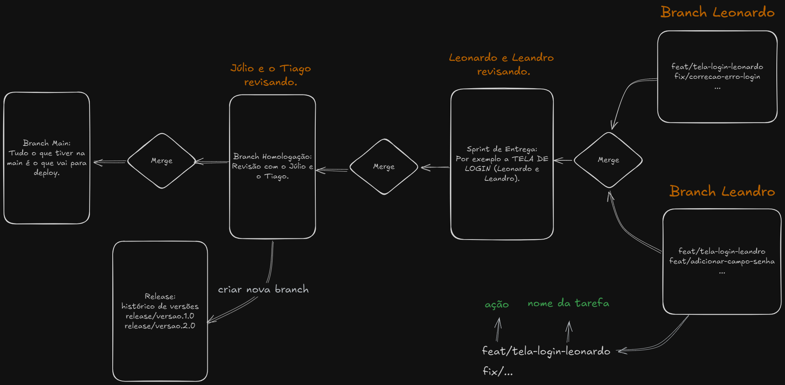

# Projeto PD Sistema Frontend

## 📝 Descrição

Este é um projeto de front-end desenvolvido em Angular 17.3.11 e Node.js 20.18.0, projetado por uma equipe de desenvolvedores com o objetivo de renovar o sistema [PD Case ERP](https://www.pdcase.com/pderp/autentica/login.aspx?&retornoUrl=/pderp/home/default.aspx&queryUrl). Este documento fornece informações completas sobre as versões escolhidas, configuração do ambiente de desenvolvimento, uso do Git e boas práticas de trabalho em equipe.

<p align="right">(<a href="#readme-top">back to top</a>)</p>

## 💻 Tecnologias

- **Angular 17.3.11**: Esta versão do Angular foi escolhida por suas melhorias em performance, segurança e escalabilidade, atendendo às demandas do projeto.

    [![Angular][Angular.io]][Angular-url]

- **Node.js 20.18.0 LTS**: A versão 20.18.0 do Node.js é a mais recente versão LTS (Long Term Support), oferecendo suporte estendido, correções de segurança e alta confiabilidade para ambientes de produção, assegurando estabilidade e compatibilidade com o Angular 17.3.11.

    [![NodeJS][NodeJS.org]][NodeJS-url]

- **Bootstrap 5**: Utilizaremos o Bootstrap 5 para facilitar a criação de uma interface de usuário responsiva e estilizada. A integração com o Angular garante uma experiência consistente e aprimora a agilidade no desenvolvimento do front-end.

    [![Bootstrap][Bootstrap.com]][Bootstrap-url]

<p align="right">(<a href="#readme-top">back to top</a>)</p>

## ⚙ Configuração

Para garantir que todos os desenvolvedores utilizem a mesma versão do Node.js, recomendamos o uso do **NVM (Node Version Manager)** para gerenciar versões do Node.js. Abaixo estão as instruções detalhadas para configurar o NVM no Windows, além da instalação do Angular CLI.

### Instalando o NVM no Windows

1. Baixe o instalador do NVM para Windows:
   - Acesse [nvm-windows/releases](https://github.com/coreybutler/nvm-windows/releases) e baixe a versão mais recente do instalador (`nvm-setup.zip`).

2. Execute o instalador e siga as instruções. Certifique-se de instalar o NVM em um diretório diferente do diretório de instalação do Node.js para evitar conflitos.

3. Após a instalação, abra um novo terminal e verifique a versão do NVM:

```bash
nvm version
```

Instalando e Usando a Versão Correta do Node.js
Instale a versão LTS do Node.js que estamos utilizando no projeto (20.18.0):

```bash
nvm install 20.18.0
```

Defina essa versão como a ativa no ambiente:

```bash
nvm use 20.18.0
```

Verifique se a versão correta do Node.js está ativa:

```bash
node -v
```

<p align="right">(<a href="#readme-top">back to top</a>)</p>

## 🚀 Instalando o Angular CLI

Após configurar a versão correta do Node.js, instale o Angular CLI para facilitar o desenvolvimento Angular:

```bash
npm install -g @angular/cli@17.3.11
```

Clonando o Projeto e Instalando Dependências

Passo 1: Clonar o Repositório

Para clonar o repositório em seu diretório local, execute:

```bash
git clone https://www.pdcase.com/git/julio.pereira/pd-sistema-frontend.git
```

Passo 2: Navegar para o Diretório do Projeto
Acesse o diretório clonado:

```bash
cd pd-sistema-frontend
```

Passo 3: Instalar as Dependências

<p align="right">(<a href="#readme-top">back to top</a>)</p>

## 💡 Importante

Antes de executar o projeto, é essencial instalar os módulos Node necessários. Certifique-se de estar usando a versão correta do Node.js especificada pelo projeto, garantindo compatibilidade e funcionamento adequado. Em sistemas Windows, a execução do comando `npm install` pode exigir privilégios administrativos para evitar erros de instalação. Se necessário, abra o terminal com permissões de administrador.

Para instalar as dependências execute o comando a seguir na pasta do projeto:

```bash
npm install
```

<p align="right">(<a href="#readme-top">back to top</a>)</p>

## 🔗 Fluxo no Repositório Git

A imagem a segui resume o fluxo e organização dentro do repositório remoto.



<p align="right">(<a href="#readme-top">back to top</a>)</p>

## ☑ Padrões do Git

### Estrutura das Branches

Para manter a organização e a clareza no trabalho em equipe, utilizaremos uma estrutura de branches com nomenclatura específica:

- **main**: branch principal de produção, contendo a versão estável para deploy.
- **homologacao**: branch para desenvolvimento ativo e testes antes da integração na main.
- **feat**: branches curtas para novas funcionalidades ou melhorias. Removidas após o merge.

```bash
feat/nova-tela-login
feat/adicionar-auth
feat/melhorias-interface
```

- **fix**: branches dedicadas a corrigir bugs específicos.

```bash
fix/corrigir-erro-login
fix/ajustar-tamanho-imagem
```

- **release**: branches usadas para preparar versões do projeto antes de lançar.

```bash
release/1.0.0
release/v2.1
```

<p align="right">(<a href="#readme-top">back to top</a>)</p>

### Convenção de Commits

Para padronizar a escrita de commits e manter um histórico organizado, seguimos a seguinte convenção:

- **feat**: Adição de uma nova funcionalidade ou serviço. 

    ```bash
    feat: criação do componente de login
    ```

- **fix**: Correção de bugs no sistema.

    ```bash
    fix: correção na função de autenticação
    ```

- **refactor**: Refatoração de código sem mudanças na lógica.

    ```bash
    refactor: renomear função de validação
    ```

- **test**: Criação ou modificação de testes.

    ```bash
    test: adicionar teste unitário para o componente de header
    ```

- **docs**: Alterações na documentação do projeto.

    ```bash
    docs: atualizar instruções de instalação no README
    ```

### Boas Práticas 

- Commits Atômicos: Cada commit deve representar uma mudança única e lógica, facilitando o rastreamento e a reversão de alterações. Evite misturar correções de bugs com novas funcionalidades.
- Commits Pequenos e Frequentes: Preferimos commits menores e frequentes para que o histórico de desenvolvimento seja fácil de revisar e gerenciar.

<p align="right">(<a href="#readme-top">back to top</a>)</p>

## 🔥 Executando o Projeto

Antes de começar a editar o código, crie uma branch de desenvolvimento com o nome da sua funcionalidade ou correção de bug:

```bash
git checkout -b feat/nome-da-feat
```

Para iniciar o servidor de desenvolvimento primeiro certifique-se de estar no diretório do projeto e depois execute o comando:

```bash
ng serve
```

Acesse a aplicação no navegador em http://localhost:4200. O servidor recarregará automaticamente sempre que houver alterações no código.

Lembre-se de que, se houver algum erro, verifique se os módulos estão instalados. Caso não estejam, execute o seguinte comando:

```bash
npm install
```

Após cada alteração efetiva é só fazer o commit e push das suas alterações para o repositório:

```bash
git add .
git commit -m "feat: descrição da feature"
git push origin feat/nome-da-feat
```

Abra um pull request para a branch ```teste```.

<p align="right">(<a href="#readme-top">back to top</a>)</p>

<!-- MARKDOWN LINKS & IMAGES -->
<!-- https://www.markdownguide.org/basic-syntax/#reference-style-links -->
[Angular.io]:    https://img.shields.io/badge/Angular-DD0031?style=for-the-badge&logo=angular&logoColor=white
[Angular-url]:   https://angular.io/
[Bootstrap.com]: https://img.shields.io/badge/Bootstrap-563D7C?style=for-the-badge&logo=bootstrap&logoColor=white
[Bootstrap-url]: https://getbootstrap.com
[NodeJS.org]:    https://img.shields.io/badge/Node.js-339933?style=for-the-badge&logo=node.js&logoColor=white
[NodeJS-url]:    https://nodejs.org/